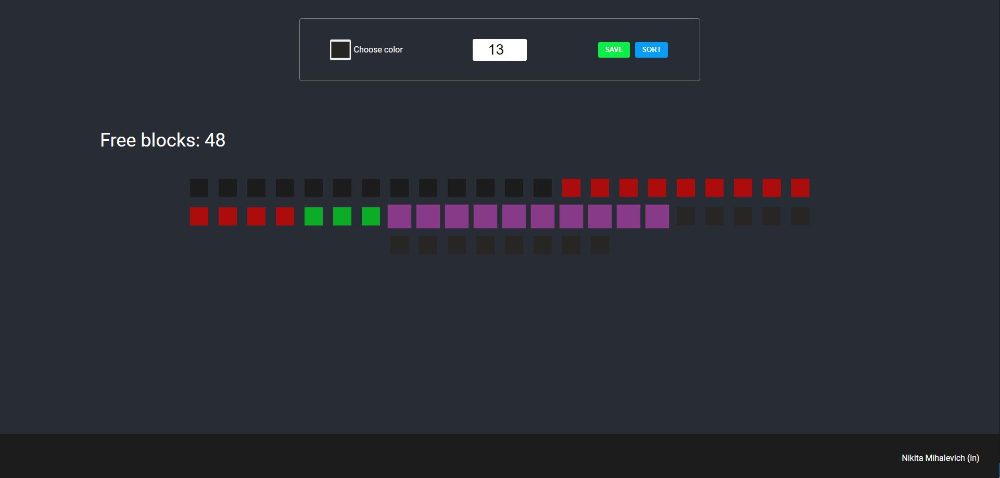

# Blocks app

Тестовое задание в компанию "Каффеста Системс". Приложение разработано для Desktop.

## Technology

1. React;
2. Redux;
3. TypeScript;
4. Redux Toolkit;
5. HTML;
5. SASS;

## Description

Реализоваy функционал: 
- Добавления блоков по условию (слева-направо, занимая все существующие пробелы).
- Ограничение длиной 100ед и форма ввода, с полями: “длиной блока” и кнопкой "SAVE", после сохраниения блок укладывается на отрезок.
- Реализована функция "упорядочивания", вызывается кнопкой "SORT" (делает блоки целыми).
- Pеализован счетчих оставшегося свободного места.
- При переполнении формы появляется информационое сообщение.
<p>*для физуального отображения различий между блоками, предлагается возможность выбра цвета добавляемого блока.</p>

Взаимадействие с блоками:

- При одинарном клике на блок, он и все его части увеличиваются.
- При двойном - удаляются, при этом остальные блоки остаются на своих местах.


*в футере есть ссылка на LinkedIn

- ### Main page

<p align="center"></p>


## Getting Started

Для запуска проекта необходимо: 

1. Клонировать репозиторий к себе (средствами git или архивом);
    ```
   git clone https://github.com/NikitaMih/test_01081323_NM.git
    ```
2. Установить взаимосвязи и необходимые библиотеки;
    ```
   npm i
    ```
3. Выполнить команду (после выполнения команды, на порту http://localhost:3000 развернется проект);
    ```
   npm run start
    ```